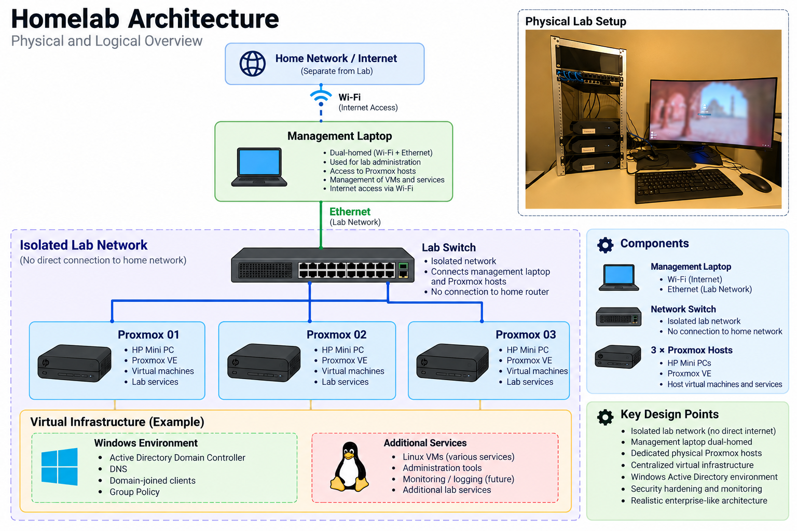

# Homelab Infrastructure

A hands-on enterprise-style homelab built to develop and demonstrate practical experience with systems administration, security, networking, automation, and cloud-native infrastructure.

## Architecture

The lab uses a dedicated, isolated network for the Proxmox infrastructure while a dual-homed management workstation provides administrative access to both the lab environment and the internet.

For additional details, see the [architecture documentation](docs/architecture.md).

## Environment

The lab is built on three physical HP systems running Proxmox VE and provides an isolated environment for deploying and managing enterprise infrastructure.

Current areas of focus include:

- Proxmox virtualization
- Windows Server administration
- Active Directory Domain Services
- Group Policy management
- Windows security hardening
- Linux administration
- Network segmentation and isolation
- Security auditing and logging
- Kubernetes
- Infrastructure as Code
- Automation

## Project Goals

This environment is designed to provide hands-on experience with:

- Designing and administering enterprise infrastructure
- Implementing security baselines and system hardening
- Managing Active Directory and Group Policy
- Troubleshooting systems and networks
- Building highly available services
- Deploying and managing Kubernetes workloads
- Implementing Infrastructure as Code
- Automating infrastructure administration

## Infrastructure

| Component | Role |
|---|---|
| 3× HP systems | Proxmox virtualization hosts |
| Proxmox VE | Hypervisor platform |
| Windows Server | Active Directory and infrastructure services |
| Linux | Server and Kubernetes workloads |
| Isolated network | Dedicated homelab environment |

## Documentation

- [Architecture](docs/architecture.md)
- [Network Architecture](docs/network.md)
- [Active Directory](docs/active-directory.md)
- [Security Hardening](docs/security-hardening.md)

## Project Status

This homelab is actively being developed. Documentation will be updated as new infrastructure, security controls, automation, and services are implemented.
